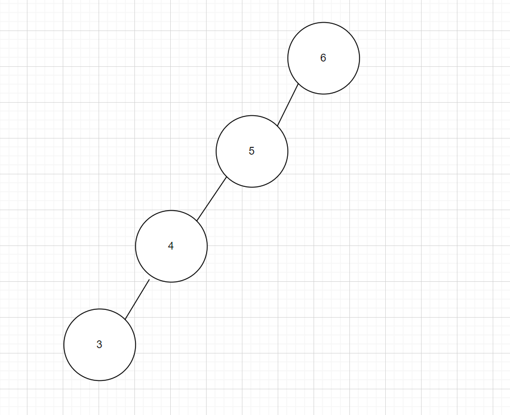
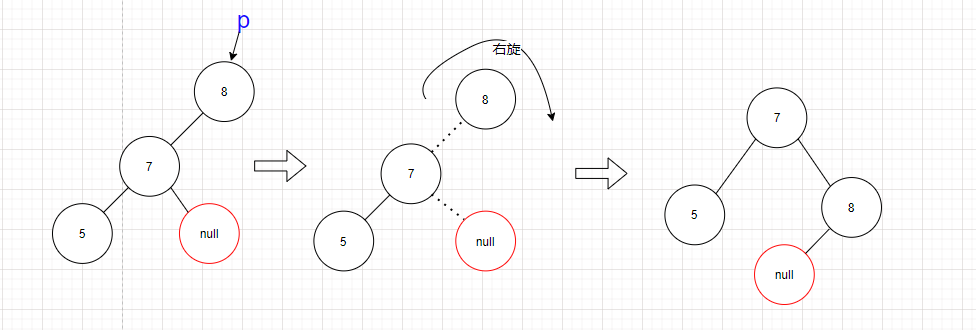
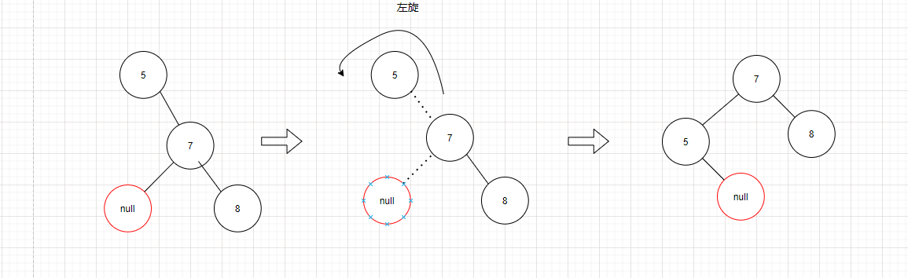
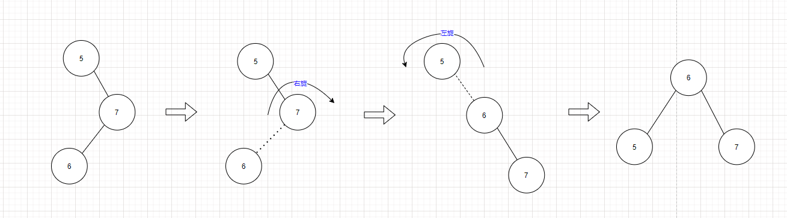
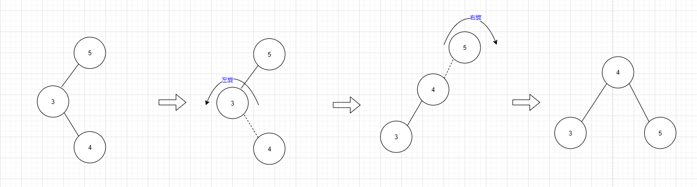

# 平衡二叉树(AVL)

[TOC]

## 前言

​		树这种数据结构在计算机的发展中起到了举足轻重的作用，众所周知时间复杂度有一项`O(logN)`,称之为对数时间复杂度，效率是极大的超越了一般所理解的线性时间复杂度`O(N)`，可以下定论的说，凡是能达到对数时间复杂度的，其结构一定是与树相关。如在一个长度为`N`有序的顺序表中查找某个元素，最差情况下至少需要遍历完整个顺序表，如果N为65535（2的16次方）,顺序表则需要循环65535次，而树结构下，仅仅只需要16次（$log_2^{65535}=16$），数据规模越大，树的查找提升效率越明显。

​		所以日常的计算机科学中，与树型数据结构相关名词的都涉及到了极限的性能优化，如：`堆排序`、`归并排序`、`计算机文件目录`、`任意关系型数据库`、`搜索引擎设计`、`海量词频统计`、`关键字过滤算法`...，这些功能的设计都有相同点，即需要处理极大的数据量。但是在树的设计中，往往也会存在某些问题，这里我们举例二叉搜索树，二叉搜索树在插入数据本身是有序情况下，通常会转换为线性时间复杂度，如下图所示。



​		基于上述问题，我们试图考虑，有没有一种可能性，能让二叉搜索树能时刻保持平衡。于是这就是今天所引入的**平衡二叉树**，也称为**AVL树**

​		在[计算机科学](https://baike.baidu.com/item/计算机科学/9132)中，**AVL树**是最先发明的自平衡二叉查找树。在AVL树中任何节点的两个子树的高度最大差别为1，所以它也被称为**高度平衡树**。增加和删除可能需要通过一次或多次[树旋转](https://baike.baidu.com/item/树旋转)来重新平衡这个树。AVL树得名于它的发明者G. M. Adelson-Velsky和E. M. Landis，他们在1962年的论文《An algorithm for the organization of information》中发表了它。

​	

## 一、特性

### 1. 具备二叉搜索树特性

+ 左结点的值小于根结点的值

+ 右结点的值大于等于根结点的值
+ 除了叶子结点以外的分叉结点最多只能有两个子结点

### 2. 子树高度的差不能大于1

## 二、旋转操作


### 1. 左子树左边高度差大于1，在对应结点右旋



```c++

struct Node {
    Node right,left;
    int data;
}

void rotateR(Node p){
    Node left = p.left;
    p.left = left.right;
    left.right = p;
}
```


### 2. 右子树右边高度差大于1，在对应结点左旋



```c++
struct Node {
    Node right,left;
    int data;
}

void rotateL(Node p){
    Node right = p.right;
    p.rig = right.left;
    right.left = p;
}
```


### 3. 左子树的右边高度差大于1，先在对应结点的子结点右旋再在对应结点左旋



```c++
struct Node {
    Node right,left;
    int data;
}

void rotateRL(Node p){
    rotateR(p.right);
    rotateL(p);
}
```


### 4. 右子树的左边高度差大于1，先在对应结点的子结点左旋再在对应结点右旋



```c++
struct Node {
    Node right,left;
    int data;
}

void rotateRL(Node p){
    rotateL(p.left);
    rotateR(p);
}
```

